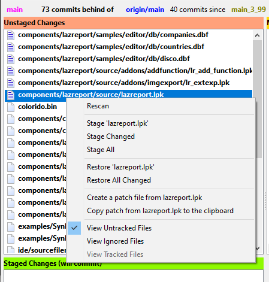

**LazGitGui**

This is yet another git tool, resembling 'git gui' with some additional features. I started this tool because it was not available, by default, under mac os, as it is under Linux and windows (when you install git by your own).

It was built also as a test for doing some git commands, with the ultimate goal
of doing a Lazarus integration.

**Screenshots.**

**How to use.**

LazGitGui requires a path passed as the last parameter in the command line, it can be a directory or a file residing within the working area of the repository. Some suggestions for invoking LazGitGui:

From Lazarus, an external tool can be configured with the following properties:

(Linux + Windows)

    Title: LazGitGui
    Program Filename: PATH/TO/LazGitGui executable
    Parameters: --logfile=PATH/TO/LazGitGui/ide.log $EdFile()
    Shortcut: CTRL+ALT+G

(macOS)

    Title: LazGitGui
    Program Filename: open
    Parameters: -a PATH/TO/LazGitGui.app --args --logfile=PATH/TO/LazGitGui/ide.log $EdFile()
    Shortcut: CMD + G

**At start**

The program tries to find the git executable in the system (or user) path, once located, it gets stored in the LazGitGui config file. LazGitGui does this only once, the next time the program is started, the git executable path is read from the config file.

In the case LazGitGui was unable to locate the git program, or if one specific version of git is needed, one have to edit the config file and introduce the git location there. At the moment, LazGitGui doesn't have a config screen.

The config file can be found in the following locations:

    Windows:    %LOCALAPPDATA%\appdata\lazgitgui\config\lazgitgui.cfg
    Linux/mac:  $HOME/.config/lazgitgui\lazgitgui.cfg

for example (this works under linux):

    [lazgitgui.cfg]
    git=/usr/bin/git

As an alternative for editing the config file, a command line parameter `--git=PATH/TO/GIT_EXECUTABLE` is available.

**Status screen**

The main screen is a graphic representation of the git status together with some extra information that allows us, with a quick look, to obtain the general status of the repository.

*Branch status* 

In this section, the current branch (at the left) is presented, next, information about how many not yet pushed local commits are (commits ahead) and how many commits the remote end has that you don't (commits behind), next is the name of the remote (tracking) branch. If enabled, next is information about how many commits are there since the last tag in the branch.

The "current branch" label, has a context menu: 

From there a new branch can be created, or the repository can be switched to an existing local branch, the current branch is selected in this list.

Note. Deleting branches in implemented in the log window.

*Unstaged list*

In this list are presented the changes in the working area, the type of changes is represented with a distictive icon at the start of the file name. All changed files are presented as relative to the top level directory of the reposistory. Files in this list are "moved" to the staged list by clicking the icon o by using other options available in the context menu:

Here, options to move the selected file, all changed files or all files including files not yet tracked. Also, changes on files can be discarded using the restore functions.

If only untracked files are selected, the menu presents some options for ignoring an indivual file or a group of files of the same type. Ignoring files in this list will modify the repository top level .gitignore file:

