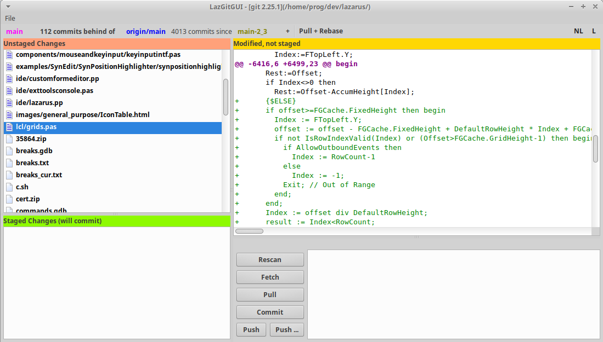
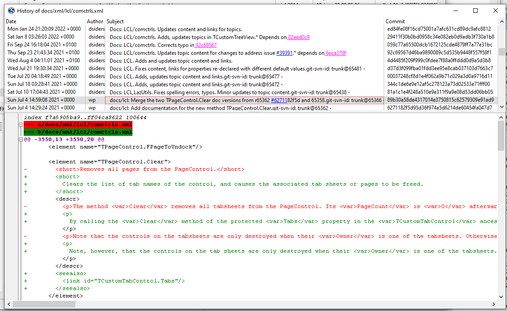

**LazGitGui**

This is yet another git tool, resembling 'git gui' with some additional features. I started this tool because it was not available, by default, under mac os, as it is under Linux and windows (when you install git by your own).

It was built also as a test for doing some git commands, with the ultimate goal
of doing a Lazarus integration.

**Screenshots.**

**Documentation**

See docs/documentation.md